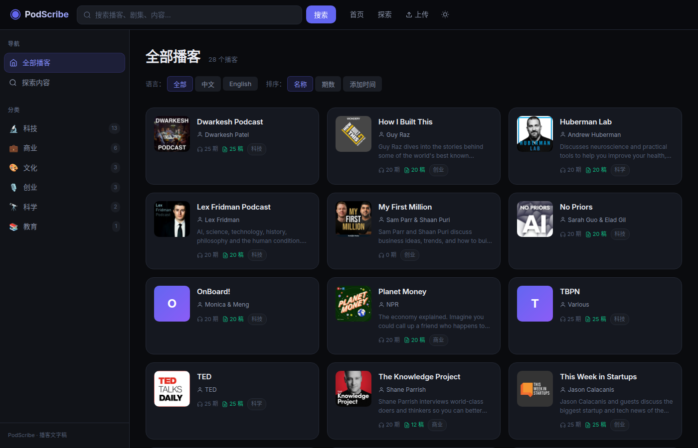
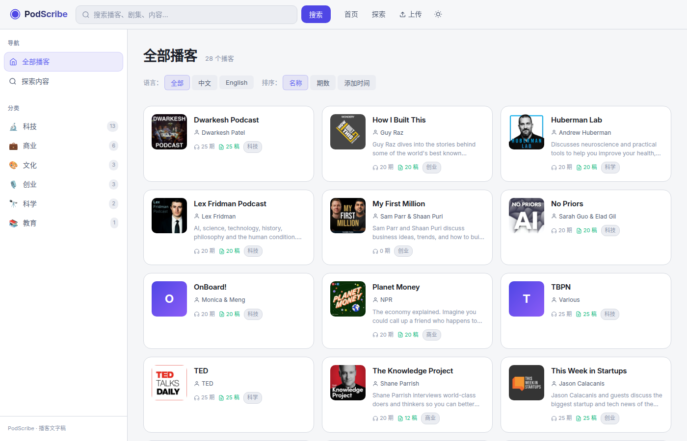
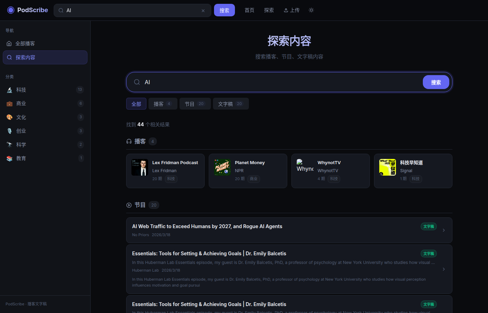

<p align="center">
  
</p>

<h1 align="center">PodScribe</h1>

<p align="center">
  A modern podcast transcript forum for browsing, searching, and contributing podcast transcripts across multiple languages.
</p>

<p align="center">
  
  
  
  
  
  
</p>

## Screenshots

### Homepage

| Dark | Light |
|------|-------|
|  |  |

### Episode View


### Search



## Features

- **Multi-language transcripts** — View and switch between transcript languages; default display in the podcast's original language
- **Full-text search** — Trigram-based search across podcast names, episodes, transcript content, and guest names
- **Reading mode** — Distraction-free transcript reading with floating toggle
- **Embedded media player** — Play episodes with synchronized transcript highlighting
- **Revision history** — Git-like versioning for community-contributed transcript edits
- **Anonymous upload** — Submit transcripts via web UI or Chrome extension
- **Speaker tags** — Normalized speaker labels with visual differentiation
- **Light / dark theme** — Toggleable with system-preference-aware defaults
- **Responsive design** — Optimized for desktop and mobile
- **Category & host browsing** — Sidebar navigation by podcast category

## Tech Stack

| Layer | Tech |
|-------|------|
| Frontend | React 19, Vite 8, CSS Variables |
| Backend | Express 5, Node.js |
| Database | SQLite (better-sqlite3) with WAL mode, FTS5 trigram search |
| Testing | Jest, Supertest |

## Quick Start

```bash
# Install dependencies
npm install
cd client && npm install && cd ..

# Seed the database (optional)
npm run seed

# Development (two terminals)
npm run dev:server   # Express API on :4010
npm run dev:client   # Vite dev server on :5173

# Production build
npm run build
npm start            # Serves both API and built frontend on :4010
```

## Project Structure

```
├── client/                 # React frontend
│   ├── src/
│   │   ├── components/     # Header, Sidebar, MediaPlayer, TranscriptEditor, ...
│   │   ├── pages/          # Home, Episode, Podcast, Search, Upload
│   │   └── styles/         # Global CSS, theme variables
│   └── vite.config.js
├── server/                 # Express backend
│   └── src/
│       ├── routes/         # podcasts, episodes, search, upload, revisions
│       ├── db.js           # SQLite setup + FTS5 trigram migration
│       └── index.js        # Express app
├── scripts/                # Utility scripts (seed, crawl, ASR, translation)
├── tests/                  # API test suite
└── data/                   # SQLite database (gitignored)
```

## API

All endpoints are under `/api`.

| Method | Endpoint | Description |
|--------|----------|-------------|
| GET | `/api/health` | Health check |
| GET | `/api/podcasts` | List all podcasts |
| POST | `/api/podcasts` | Create a podcast |
| GET | `/api/podcasts/:id` | Get podcast with episodes |
| GET | `/api/episodes/:id` | Get episode with transcripts |
| GET | `/api/search?q=...&type=...` | Full-text search |
| POST | `/api/upload` | Anonymous upload (podcast + episode + transcript) |
| GET | `/api/episodes/:id/revisions` | Revision history |
| POST | `/api/episodes/:id/revisions/:sha/restore` | Restore a revision |

## Testing

```bash
npm test
```

Runs the full API test suite (~50 test cases) covering CRUD operations, search, multi-language transcripts, revisions, uploads, and cascade deletes.

## Scripts

| Script | Description |
|--------|-------------|
| `npm run seed` | Seed database with sample data |
| `npm run crawl` | Crawl podcast sources for transcripts |
| `node scripts/asr-zh.js` | Local ASR pipeline for Chinese podcasts |
| `node scripts/translate-to-zh.js` | Translate English transcripts to Chinese |
| `node scripts/batch-polish.js` | LLM-powered transcript polishing |

## Codex Skills

This repo now includes repo-local Codex skills under [`.codex/skills`](/home/mhliu/podcast-transcript-forum/.codex/skills) for the two workflows that are most repetitive here:

- [`podcast-transcript-pipeline`](/home/mhliu/podcast-transcript-forum/.codex/skills/podcast-transcript-pipeline/SKILL.md) for episode updates, ASR, repolish, postprocess, and transcript QA.
- [`podcast-forum-deploy`](/home/mhliu/podcast-transcript-forum/.codex/skills/podcast-forum-deploy/SKILL.md) for main-repo builds, `newserver` deployment, restart, and verification.

## License

ISC
